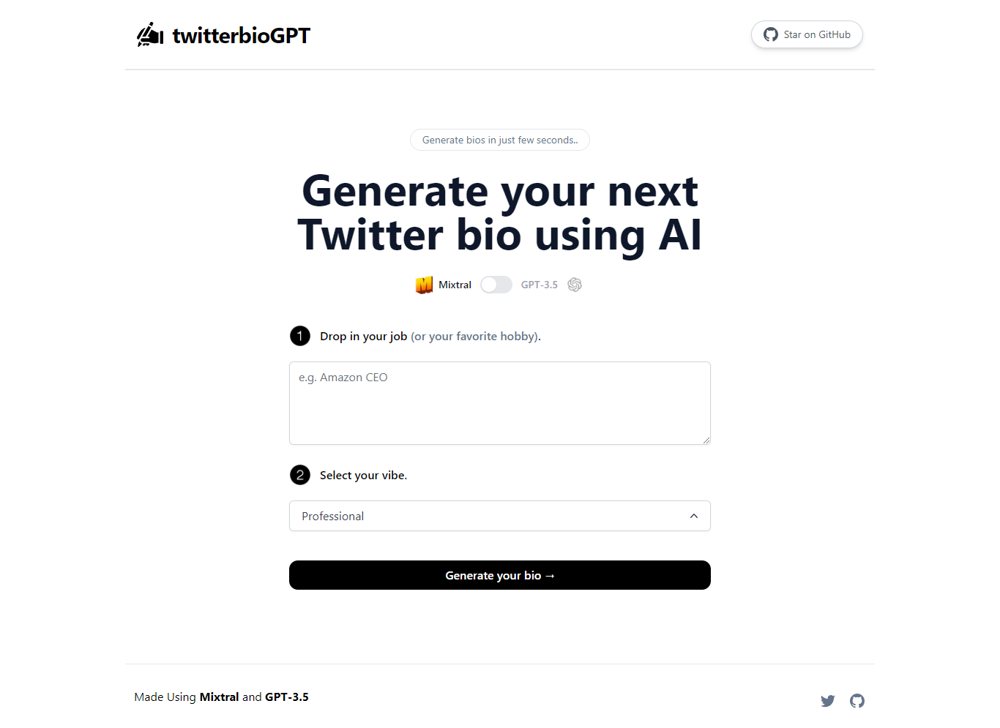

# [twitterbiogpt](https://twitterbiogpt.vercel.app/)

This project generates Twitter (X) bios for you using AI.

## How it works

This project uses both [Mixtral](https://mistral.ai/news/mixtral-of-experts/) and [GPT-3.5](https://openai.com/api/) with streaming to generate a Twitter bio. It constructs a prompt based on the form and user input, sends it either to the Mixtral API through [Together.ai](https://www.together.ai/) or the GPT-3.5 API through OpenAI, then streams the response back to the application.

